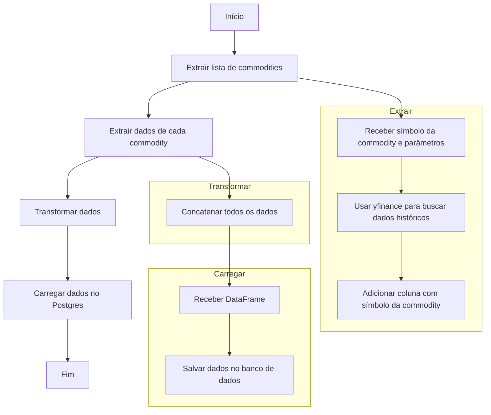

# DW do Zero

```mermaid
graph TD;
    A[Início] --> B[Extrair lista de commodities]
    B --> C[Extrair dados de cada commodity]
    C --> D[Transformar dados]
    D --> E[Carregar dados no Postgres]
    E --> F[Fim]

    subgraph Extrair
        C1[Receber símbolo da commodity e parâmetros]
        C2[Usar yfinance para buscar dados históricos]
        C3[Adicionar coluna com símbolo da commodity]
        C1 --> C2
        C2 --> C3
    end

    subgraph Transformar
        T1[Concatenar todos os dados]
    end

    subgraph Carregar
        L1[Receber DataFrame]
        L2[Salvar dados no banco de dados]
        L1 --> L2
    end

    B --> C1
    C --> T1
    T1 --> L1
```